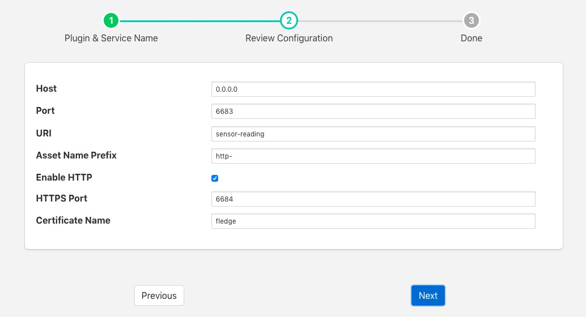

.. Images

.. Links
.. |http-c| raw:: html

   <a href="../fledge-north-http-c/index.html">C++ version</a>

.. |http-python| raw:: html

   <a href="../fledge-north-http/index.html">Python version</a>

.. |CertificateStore| raw:: html

   <a href="../../securing_fledge.html#certificate-store">Certificate Store</a>

South HTTP
==========

The *fledge-south-http* plugin allows data to be received from another Fledge instance or external system using a REST interface. The Fledge which is sending the data to the corresponding north task with the HTTP north plugin installed. There are two options for the HTTP north |http-c| or |http-python|, these serve the dual purpose of providing a data path between Fledge isntances and also as examples of how other systems might use the REST interface from C/C++ or Python. The plugin supports both HTTP and HTTPS transport protocols and sends a JSON payload of reading data in the internal Fledge format.

The primary purpose of this plugin is for Fledge to Fledge communication however, there is no reason to prevent other applications that wish to send data into a Fledge system to not use this plugin also. The only requirement is that the application that is sending the data uses the same JSON payload structure as Fledge uses for passing reading data between different instances. Data should be sent to the URL defined in the configuration of the plugin using a POST request. The caller may choose to send one or many readings within a single POST request and those readings may be for multiple assets.

To create a south service you, as with any other south plugin

  - Select *South* from the left hand menu bar.

  - Click on the + icon in the top left

  - Choose http_south from the plugin selection list

  - Name your service

  - Click on *Next*

  - Configure the plugin

    +----------+
    | |http_1| |
    +----------+

    - **Host**: The host name or IP address to bind to. This may be left as default, in which case the plugin binds to any address. If you have a machine with multiple network interfaces you may use this parameter to select one of those interfaces to use.

    - **Port**: The port to listen for connection from another Fledge instance.

    - **URL**: URI that the plugin accepts data on. This should normally be left to the default.

    - **Asset Name Prefix**: A prefix to add to the incoming asset names. This may be left blank if you wish to preserve the same asset names.

    - **Enable HTTP**: This toggle specifies if HTTP connections should be accepted or not. If the toggle is off then only HTTPS connections can be used.

    - **Certificate Name**: The name of the certificate to use for the HTTPS encryption. This should be the name of a certificate that is stored in the Fledge |CertificateStore|.

  - Click *Next*

  - Enable your service and click *Done*

JSON Payload
------------

The payload that is expected by this plugin is a simple JSON presentation of a set of reading values. A JSON array is expected with one or more reading objects contained within it. Each reading object consists of a timestamp, an asset name and a set of data points within that asset. The data points are represented as name value pair  JSON properties within the reading property.

The fixed part of every reading contains the following

+-----------+----------------------------------------------------------------+
| Name      | Description                                                    |
+===========+================================================================+
| timestamp | The timestamp as an ASCII string in ISO 8601 extended format.  |
|           | If no time zone information is given it is assumed to indicate |
|           | the use of UTC.                                                |
+-----------+----------------------------------------------------------------+
| asset     | The name of the asset this reading represents.                 |
+-----------+----------------------------------------------------------------+
| readings  | A JSON object that contains the data points for this asset.    |
+-----------+----------------------------------------------------------------+

The content of the *readings* object is a set of JSON properties, each of which represents a data value. The type of these values may be integer, floating point, string, a JSON object or an array of floating point numbers.

A property

.. code-block:: console

"voltage" : 231

would represent a numeric data value for the item *voltage* within the asset. Whereas

.. code-block:: console

    "voltageUnit" : "volts"

Is string data for that same asset. Other data may be presented as arrays

.. code-block:: console

   "acceleration" : [ 0.4, 0.8, 1.0 ]

would represent acceleration with the three components of the vector, x, y, and z. This may also be represented as an object

.. code-block:: console

   "acceleration" : { "X" : 0.4, "Y" : 0.8, "Z" : 1.0 }

both are valid formats within Fledge.

An example payload with a single reading would be as shown below

.. code-block:: console

    [
       {
           "timestamp" : "2020-07-08 16:16:07.263657+00:00",
           "asset"     : "motor1",
           "readings"  : {
                         "voltage"  : 239.4,
                         "current"  : 1003,
                         "rpm"      : 120147
                         } 
       }
   ]

